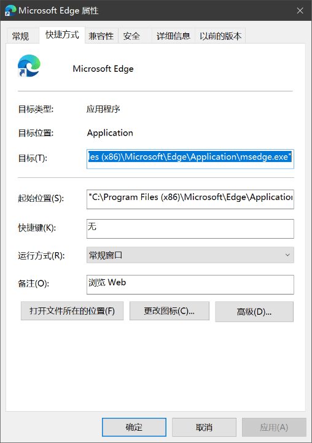
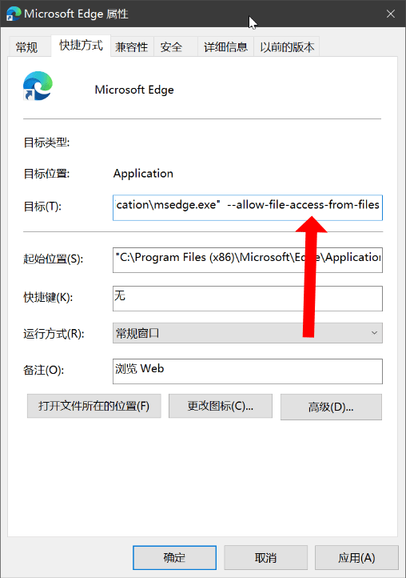

[中文](./README.md)　|　[English](./README_en.md) 

[Gitee](https://gitee.com/haujet/ShortcutMapper_Chinese )　|　[Github](https://github.com/HaujetZhao/ShortcutMapper_Chinese) 

# Shortcut Mapper 中文

## ⭐ 简介

这是一个键盘快捷键可视化工具，托管在 Github 和 Gitee：

* https://haujetzhao.github.io/ShortcutMapper_Chinese/
* https://haujet.gitee.io/shortcutmapper_chinese/ 

这个项目的目标是，将应用程序的 **快捷键** 映射到 **虚拟键盘** 上，以便于查找和学习新的快捷键。 

项目 fork 自 https://github.com/waldobronchart/ShortcutMapper ，原版是英文版，欢迎前去支持

整个项目的入口就是 `index.html` 这个文件。

使用、添加快捷键、添加应用的视频教程详见：https://www.bilibili.com/video/BV1GX4y1L7EY

## 📝 背景

总览

```
/content         网站内容
    /generated   包含生成的包含应用快捷键的 json/js 文件（以本网站格式储存）
    /keyboards   包含 html 键盘布局
    ...
/sources         每个应用快捷键的源文件、更新脚本
/shmaplib        Python 工具库，用于帮助导出快捷工具到 webapp 
/tests           Python 测试，确保没有错误
/utils           用于导出和测试的工具
index.html       主站点
```

## 🛠️ 贡献

### 本地运行

本站的唯一一个页面就是 **index.html** ，理论上双击打开即可使用。

可是这个应用使用 ajax 请求，以载入快捷键数据。

因为安全原因，ajax 从本地使用 file:// 协议时会失败，所以直接用浏览器从本地打开会失败。

因此本地运行需要使用这两种方法：

- 安装 Python 后，运行根文件夹下的 `启动.py`，就打开了。这个脚本会将本文件夹用 HTTP 协议服务在在本地 8000 端口上。只要在浏览器访问 `0.0.0.0:8000` 即可访问。**这是最简单的方法，也是最推荐的。**
- 按如下步骤设置一下浏览器。

#### 设置浏览器

以 Windows 上的 Edge 浏览器为例，将 Edge 浏览器关闭后，在桌面上右击 Edge 浏览器图标，打开属性：



在 `目标` 一栏后面加上 `--allow-file-access-from-files` ：



点击确定，再启动 Edge 浏览器，用它打开 **index.html** 就可以正常显示快捷键了

### 新增应用快捷键

最好的例子是 `sources/windows` ，将这个文件夹复制一份，例如复制到  `sources/photoshop` ，打开该文件夹

一、编辑下 ` 01 生成中间文件.py` ，主要修改里面这句：

```python
idata = shmaplib.IntermediateShortcutData(app_name="Windows", version="10", default_context="通用")
```

例如改成：

```python
idata = shmaplib.IntermediateShortcutData(app_name="PhotoShop", version="cc", default_context="笔刷工具")
```

二、在 `sources/Vditor` 中你可以找到例子，将快捷键按以下格式填写到 `windows.csv` 和 `mac.csv` 中

```
情景    功能    按键1    按键3    ....
```

按键的标准名字你可以在 `shmaplib/keynames.py` 中找到，按键名字不用区分大小写。

Linux 的快捷键一般与windows相同，所以目前先忽略。

三、再运行 `01 生成中间文件.py`，就会生成 `intermediate.json`，检查下这个文件中有没有需要修改的错误，再运行 `02 将中间文件添加到正式目录.py`，就会将这个 app 的快捷键更新到 Shortcut Mapper 了。

## 🔋 打赏

项目 fork 自 https://github.com/waldobronchart/ShortcutMapper ，原版是英文版，欢迎前去支持

本软件完全开源，用爱发电，如果你愿意，可以以打赏的方式为我充电：


## 😀 交流

如果有软件方面的反馈可以提交 issues，或者加入 [QQ 群：1146626791](https://qm.qq.com/cgi-bin/qm/qr?k=DgiFh5cclAElnELH4mOxqWUBxReyEVpm&jump_from=webapi) 